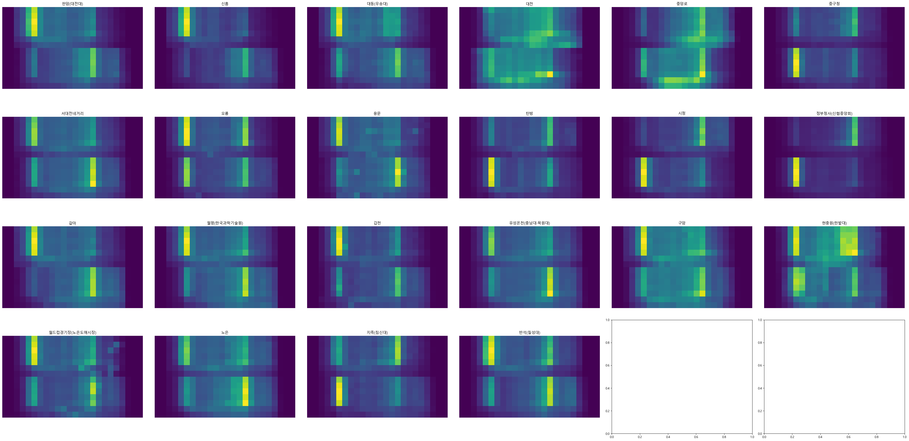
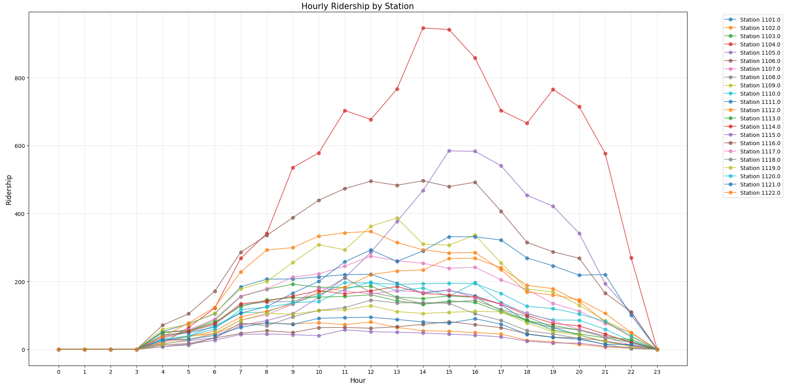
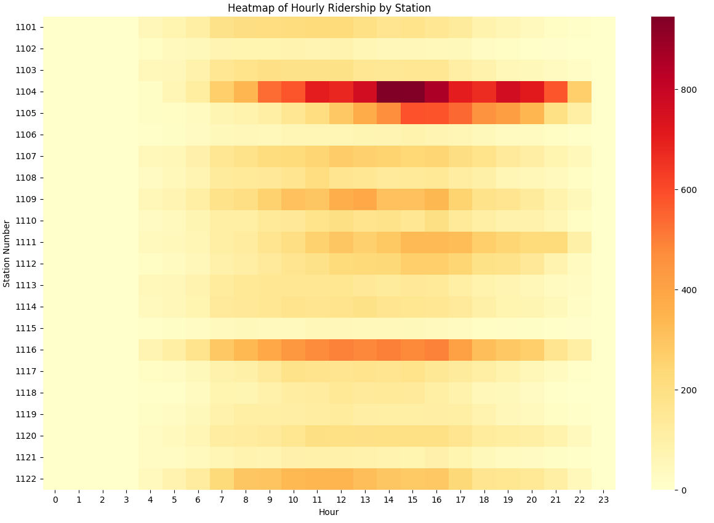

# Team 시계열심 ⏰🔥

## 제2회 지역사회 문제해결형 빅데이터/AI활용 공모전 (2024) 풀이에 오신걸 환영합니다.

### 사용한 모델: [TimeXer: Empowering Transformers for Time Series Forecasting with Exogenous Variables](https://arxiv.org/abs/2402.19072)

### 제출 파일: code.ipynb [링크](https://github.com/castleeun/Time_series_data/blob/main/code.ipynb)
---

## 데이터 EDA 및 Preprocessing

<p align="center">

<b>2024년도 요일 및 역 별 승하차 평균 시각화</b>
</p>
이 때, 각 열은 시간을 의미합니다. <br>
절반을 기준으로 윗부분은 승차 데이터, 아랫부분은 하차 데이터입니다.
<p>출퇴근 시간 및 평일 & 주말 승하차 수요량을 직관적으로 이해할 수 있었습니다.</p><br>

#### 이용한 데이터셋

1. 대전교통공사\_시간대별 승하차인원(22.01.01 ~ 24.10.31) - [대전교통공사](https://www.data.go.kr/data/15060591/fileData.do)
2. 종관기상관측(ASOS) 자료 - [기상청 기상자료개방포털](https://data.kma.go.kr/cmmn/main.do)

<p align="center">

<b>KNIME 프로그램을 통한 Data Preprocessing</b>
</p>
1. '승차' 구분. <br>
2. 24년은 3월 1일 ~ 10일 데이터가 없었기에 추가적인 처리.<br>
3. 각 열로 존재하던 시간 데이터를 행으로 Unpivoting.<br>
4. 날씨 데이터 Join.<br>
5. 체감온도 계산 열 생성. <br>
6. 주말 및 공휴일 Binary 처리 열 생성. <br>

#### 최종 처리 후 데이터 Column

| Date       | STATION_NO | Time  | <span style="background-color:yellow;">Count</span> | Temp | Precipitation | Wind | Snow | Sens_Temp | Holiday |
| ---------- | ---------- | ----- | --------------------------------------------------- | ---- | ------------- | ---- | ---- | --------- | ------- |
| YYYY-MM-DD | XXXX       | HH:MM | <span style="background-color:yellow;">NNN</span>   | T.T  | P.P           | W.W  | S.S  | S.S       | 1/0     |

<p><b>Target Column:</b> Count</p>

---

## Regression 가설 및 모델링

> **가설**  
> 날씨는 지하철 이동량에 중요한 영향을 미칠 것이다.

> **설명**
>
> - 날씨 데이터는 미리 예측할 수 있습니다. 예를 들어, 12월 1일의 날씨를 11월 30일에 높은 정확도로 알 수 있습니다.
> - 이러한 특성을 활용하기 위해, 외부 요인(exogenous data)을 모델에 포함할 수 있는 **TimeXer** 모델(NeurIPS 2024)을 사용합니다.
> - **TimeXer**는 시간 흐름에 따른 데이터를 효과적으로 처리하면서, 날씨 같은 외부 요인을 결합해 예측 정확도를 높일 수 있습니다.
> - 우리는 날씨 데이터를 지하철 이동량 예측 모델에 포함시켜, 현실적이고 신뢰성 높은 결과를 얻고자 합니다.

### 모델링: TimeXer vs ARIMA

| **ARIMA 모델**                                                                                                      | **TimeXer 모델**                                                                                                            |
| ------------------------------------------------------------------------------------------------------------------- | --------------------------------------------------------------------------------------------------------------------------- |
| ARIMA(Autoregressive Integrated Moving Average)는 주로 **과거 시계열 데이터**를 기반으로 미래를 예측합니다.         | TimeXer는 <b>외생 변수(Exogenous Data)</b>를 활용하여 예측 성능을 강화합니다.                                               |
| 주로 **정상성(Stationarity)** 가정을 필요로 하며, 데이터의 추세와 계절성을 제거해야 효과적으로 작동합니다.          | 비정상성(Non-stationary) 데이터와 <b>다중 변수(Multivariate)</b>를 효율적으로 처리할 수 있는 Transformer 기반 모델입니다.   |
| 외생 변수를 포함할 경우 ARIMAX(SARIMAX) 확장 버전을 사용해야 하며, **변수 간 상호작용**에 대한 처리가 제한적입니다. | <b>패치 단위(Self-Attention)</b>와 <b>변수 단위(Cross-Attention)</b>를 결합하여 변수 간의 상호작용을 효과적으로 학습합니다. |
| 과거 데이터의 **시점 간 상관관계**를 기반으로 예측하지만, **장기적인 종속성**을 학습하기는 어려운 경우가 많습니다.  | **장기 의존성(Long-term Dependency)** 및 변수 간 **비선형 상관관계**를 동시에 학습할 수 있습니다.                           |
| 상대적으로 단순하고 해석이 용이하지만, 복잡한 데이터나 결측치가 포함된 경우 성능이 크게 저하됩니다.                 | 데이터의 **결측치, 시점 불일치, 주파수 차이**에도 강인한 성능을 보여줍니다.                                                 |

<p align="center">

</p>


> **Team 시계열심의 선택: TimeXer**  
> => 기존 ARIMA 기반 접근법의 한계를 극복하기 위해 TimeXer를 이용하였습니다.
>
> - TimeXer는 외생 변수를 활용해 지하철 이동량 예측 시 날씨 데이터를 효과적으로 통합할 수 있습니다.
> - 패치 및 변수 단위의 Attention 메커니즘은 데이터의 복잡성을 처리하고 정확도를 높입니다.
> - 실험 결과, TimeXer는 다양한 데이터셋에서 <b>가장 좋은 최신 성능(State-of-the-Art)</b>을 기록하며 뛰어난 일반성과 확장성을 입증했습니다.

---

## 주요 코드 설명
### Colab (Jupyter Notebook) 실행
`code.ipynb`참고 [링크](https://github.com/castleeun/Time_series_data/blob/main/code.ipynb)

### bash 환경 실행
#### Training 커맨드

```bash
#!/bin/bash

model_name=TimeXer
des='Timexer-MS'

for i in {1101..1122}
do
  python3 -u run.py \
    --task_name long_term_forecast \
    --is_training 1 \
    --root_path ./dataset/daejeon_subway/station/ \
    --data_path $i.csv \
    --model_id ${i}_80_620_f3_l3_620in \
    --model $model_name \
    --data custom \
    --features MS \
    --target Count\
    --seq_len 620 \
    --label_len 140 \
    --pred_len 620 \
    --e_layers 3 \
    --d_layers 3 \
    --enc_in 862 \
    --dec_in 862 \
    --c_out 862 \
    --d_model 512 \
    --des $des \
    --batch_size 32 \
    --itr 1\
    --use_amp\
    --train_epochs 20\
    --num_workers 20\
    --factor 3
done
```

#### Prediction 커맨드

```bash
model_name=TimeXer
des='Timexer-MS'

python3 -u run.py \
  --task_name long_term_forecast \
  --is_training 0 \
  --root_path ./dataset/daejeon_subway/one_month_station \
  --data_path 1105.csv \
  --model_id daejeon_80_620_f3_l3_620in \
  --model $model_name \
  --data custom \
  --features MS \
  --target Count\
  --seq_len 620 \
  --label_len 40 \
  --pred_len 620 \
  --e_layers 3 \
  --d_layers 3 \
  --enc_in 862 \
  --dec_in 862 \
  --c_out 862 \
  --d_model 512 \
  --des $des \
  --batch_size 1 \
  --itr 1\
  --use_amp\
  --train_epochs 20\
  --num_workers 20\
  --factor 3\
  --inverse\
  --infer
```

---

## 결론

### 핵심 요약

- **TimeXer** 모델을 통해 날씨와 지하철 이동량의 관계를 학습하여 Regression했습니다.
- 기존 ARIMA 모델 대비 TimeXer는 외생 변수(exogenous variables)를 처리하는 데 강점을 보이며, 복잡한 데이터에서도 높은 성능을 보여주었습니다.
- 특히 출퇴근 시간대의 승차량과 날씨 데이터를 결합하여, 더욱 현실적이고 신뢰성 있는 예측을 구현할 수 있었습니다.

### 주요 결과 시각화

<p align="center">

<b>Figure 1: TimeXer 모델을 이용한 예측 결과 - Line Chart</b>
</p>

- Figure 1은 특정 역에서의 시간대별 승차량 예측 결과를 보여줍니다. TimeXer 모델은 실제 데이터와 높은 일치도를 보이며, 날씨 데이터를 포함한 예측의 강점을 확인할 수 있습니다.

<p align="center">

<b>Figure 2: TimeXer 모델을 이용한 예측 결과 - Heatmap</b>
</p>

- Figure 2 또한 특정 역에서의 결과를 나타냅니다. 1104(대전역), 1105(중앙로역), 1116(유성온천역)의 수요량이 다른 역에 비해 극명하게 드러나는 추세를 관찰할 수 있습니다.

### 2차 발표시 내용

- Arima 모델과의 성능 비교
- 12월 1일 ~ 6일 예측 결과
- 11월 예측 결과 및 성능
  <br>

#### 감사합니다.<br><br>

```
@article{wang2024timexer,
  title={Timexer: Empowering transformers for time series forecasting with exogenous variables},
  author={Wang, Yuxuan and Wu, Haixu and Dong, Jiaxiang and Liu, Yong and Qiu, Yunzhong and Zhang, Haoran and Wang, Jianmin and Long, Mingsheng},
  journal={Advances in Neural Information Processing Systems},
  year={2024}
}
```
